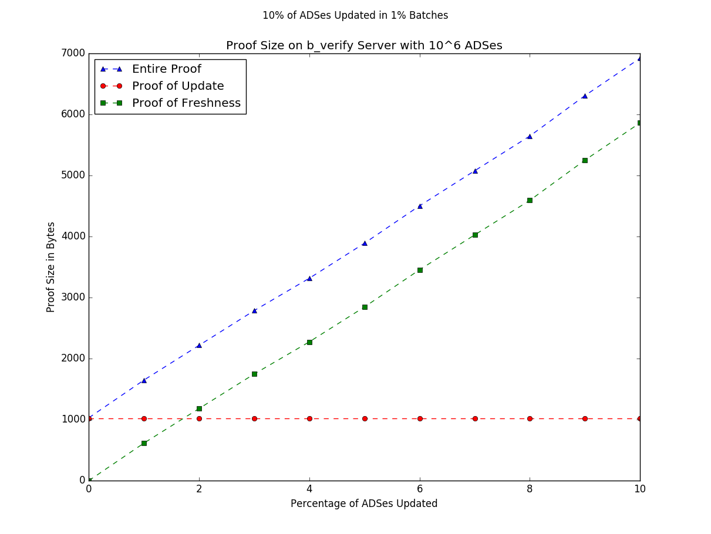

# b\_verify 

## Throughput Benchmark
To test the throughput of the b\_verify server we measure the amount of time required to process client updates. In the b\_verify protocol clients may submit updates to ADS\_ROOTs to the server. The server verifies these updates, and then commits many changes as a batch. Clients must then request proofs from the server to verify that it has performed the updates.

In a real world deployment, only a fraction of all the ADS\_ROOTs would be updated at a given time. To simulate a medium-sized real-world deployment, we created a b\_verify server that stores  

``10^6 ADS\_ROOTs``

and We will update 

``10% = 10^5 updates``

To simulate mock clients we use 500 threads to send each of the update requests individually and in parallel. The Java RMI interface begins to have problems at a load of about >5 request per millisecond, so we introduce some random delay into when the client threads actually make the requests. Overall this will only increase these benchmarks, and it is probably possible that by carefully tuning the timing we could get even better results.

### Time To Request Updates
``95.404 seconds or ~1050 request verified / second``

This is the time required for 10^5 separate clients to submit update request to the server, for the server to verify these requests and schedule the update to be committed, and then to reply ACCEPTED to the client. 

### Time To Commit (on Server)
``1.675 seconds``

This is the time required for the server to commit a batch of updates and broadcast the commitment. During this period the server cannot accept new update requests. Currently this is the time required to re-hash intermediate nodes in a the MPT. The current implementation is single threaded, so this can probably be improved.

### Time To Request Proofs 
``21.605 seconds or ~4,500 proof generated / second``

This is the time required for each of the 10^5 separate clients to request a proof showing that the update was performed. The server generates these proofs on demand and in parallel. This is because the binding constraint for the current implementation is memory and pre-computing these proofs would take a considerable amount of additional memory. 

### Total Time 
``118.684 seconds or about 2 minutes or ~800 updates / second``

Overall the complete process to update and verify 10% of the ADSes on a realistically sized serer is about 2 minutes with a total throughput just shy of a thousand updates per second. 

## Proof Size Benchmark
To test proof sizes we measured how the size of the proof for an ADS\_ROOT changes as updates to other ADSes are performed. 

To simulate a real deployment we again used a medium sized b\_verify server with 
``10^6 ADSes Total``
and again performed 
``10% = 10^5 updates``
but this time we did each of the updates in batches of

``1% of all ADSes updated in each batch = 10^4 ADS update in each batch``

and measured the size of the proof after each update.

To analyze the proof size, we split it into the ``update`` portion: the signed update and a proof that the update was performed and the ``freshness`` portion: which is a proof that the update is current and the ADS\_ROOT has not been changed since the update. 

The ``update`` protion of the proof is fixed size and does not change over time. 

The ``freshness`` proof however gets strictly larger after each commitment since the update was performed. To prove that an ADS\_ROOT is still fresh, after each commitment a partial path must be added to the freshness proof. However the partial path does not need to contain all of the pre-images on the co-path. By caching updates on the client we can reduce the sizes of these proofs by around 50%. Assymptotically if a commitment has ``U random updates`` and there are ``N total ADS\_ROOTs`` in the data structure, the freshness proof will grow by a size of ``log(N)*log(U)`` in expectation. 

### Results
Actual measurement of proof sizes confirms these results: 

 

