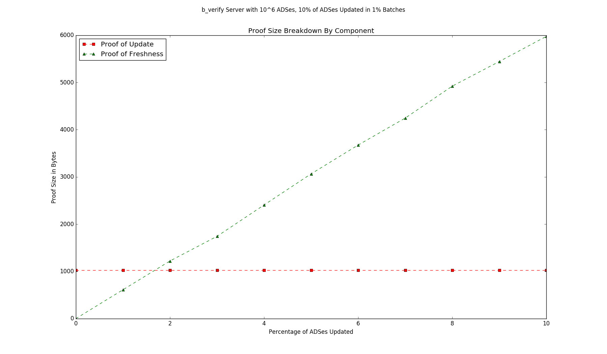
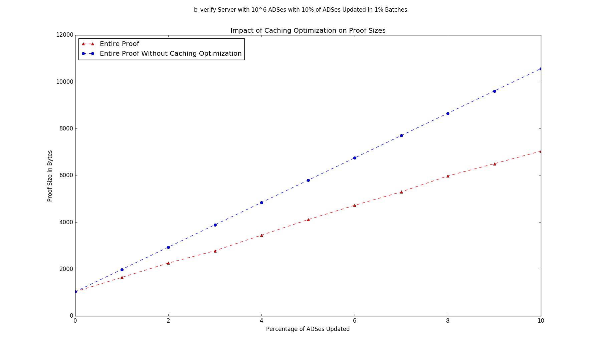

# b\_verify 

This is a customized version of the b\_verify server that serves the verification objects for authenticated data structures. The server supports a PUT/GET interface.

## Throughput Benchmark
To test the throughput of the b\_verify server we measure the amount of time required to process client updates. In the b\_verify protocol clients may update ADS\_ROOTs stored on the server. The server verifies these updates, and then commits many changes as a batch. Clients must then request proofs from the server to verify that the server has performed the updates.

In a real world deployment, only a fraction of all the ADS\_ROOTs would be updated in each batch. To simulate a medium-sized real-world deployment, we created a b\_verify server that stores  

``10^6 ADS_ROOTs``

and we perform 

``10% = 10^5 updates``

To simulate mock clients we use 500 threads to send each of the update requests individually and in parallel. The Java RMI interface begins to have problems at a load of about >5 request per millisecond, so we introduce some random delay into when the client threads actually make the requests. Note that this will only increase the time required for these benchmarks and it is probably possible that by carefully tuning the timing we could achieve even better results.

### Time To Request Updates
``90.474 seconds or ~1,105 requests verified / second``

This is the time required for 10^5 separate clients to submit update request to the server, for the server to verify these requests and schedule the update to be committed, and then to reply ACCEPTED to the client. 

In the b_verify protocol this consists of 

``a lookup in a hash table + 1 or more signature verification per update request``

and is done in parallel 

### Time To Commit (on Server)
``0.927 seconds``

This is the time required for the server to commit a batch of updates and broadcast the resulting commitment. During this period the server cannot accept new update requests. 

In this implementation this is the time required to re-calculate the hashes of some subset of the nodes in the MPT on the server. To determine exactly how many hashes need to be recalculated, I instrumented the code to keep track. A MPT with ``10^6 entries`` has ``2879761 total nodes``. After the updates 

``575724 or 20% of the hashes must be recalculated``

In the current implementation this is parallelized as much as possible. 

### Time To Request Proofs
``6.332 seconds or ~16,000 proofs generated / second``

This is the time required for each of the 10^5 separate clients to request a proof showing that the update was performed. The server generates these proofs in parallel. In the current implementation, proofs are generated on demand instead of being pre-computed due to memory constraints on the server. For example saving a 1 KB proof for each of the 10^6 ADS\_ROOTs requires 1 GB worth of storage. The current implementation saves only the minimal subset of pre-images required to construct the proofs on demand.   

### Total Time 
``97.733 seconds or ~1,112 updates / second``

Overall the complete process to update and verify 10% of the ADSes on a realistically sized b\_verify server is about a minute and a half with a total throughput of over a thousand updates per second. 

## Proof Size Benchmark
To test proof sizes we measured how the size of the proof for an ADS\_ROOT changes as updates to other roots are performed. 

To simulate a real deployment we again used a medium sized b\_verify server with 
``10^6 ADSes Total``
and again performed 
``10% = 10^5 updates``
but this time we did each of the updates in batches of

``1% of all ADSes updated in each batch = 10^4 ADS update in each batch``

and measured the size of the proof after each update. The reason for performing the updates as a sequence of smaller update batches is that in practice, it is unlikely that all of the ADS\_ROOTs will be updated simultaneously. Instead we expect that clients will come online at different times, request an update, wait for a proof, and then go offline. Accordingly the server will publish commitments and create proofs as update requests arrive. 

To analyze the proof size, we split it into the ``update`` portion: the signed update and a proof that the update was performed and the ``freshness`` portion: which is a proof that the update is current - that the ADS\_ROOT has not been changed since the update. 

### Theoretical Proof Size  

For a b\_verify server with ``N ADS_ROOTs``, the ``update`` portion is ``O(log(N))``, but does not grow in size as subsequent updates are performed.

The ``freshness`` proof however gets strictly larger after each subsequent commitment after the update was performed. To prove that an ADS\_ROOT is still fresh, after each commitment a partial path must be added to the freshness proof. The partial path does not need to contain all of the pre-images on the co-path - by caching updates on the client we can reduce the sizes of these proofs asymptotically.  If a commitment contains ``C random updates`` and there are ``N total ADS\_ROOTs`` in the data structure, the freshness proof will grow by a size of ``O(log(C))`` in expectation. 

Therefore the overall size of the proof for an update on a b\_verify server with ``N ADS_ROOTs`` that has since processed ``U random updates``, committed in ``batches of size C`` has size:

``size = O(log(N) + U/C*log(C))``

Note that the efficiency of these proofs depends on the ratio ``U/C``. To see this consider performing ``N`` random updates. If each commitment contains only a single update (``C = 1``), the freshness proof will consist of a single updated co-path pre-image and the proof will be of size ``O(N)``. However if instead all the ADS\_ROOTs are updated in a single commitment, then all nodes on every co-path change and the size of the proof is ``O(log(N))` and maximally efficient.

In practice the ratio ``U/C`` will be determined by the usage requirements. It reflects a tradeoff between proof size and the lost time required to batch updates. While waiting for a batch to commit the client cannot be sure that the update will be performed and thus must sit in an indeterminate state. 

### Actual Proof Size
Actual measurement of proof sizes confirms these results. 

#### Proof Size Breakdown
Here is a breakdown of the proof size into the ``update`` and ``freshness`` components. Note how the ``freshness`` component grows as new commitments are published.

#### Impact of Caching Optimization
This plot measures the impact of caching unchanged pre-images on the client. Note that this optimization reduces the size of the proofs by roughly 50%. 

 

